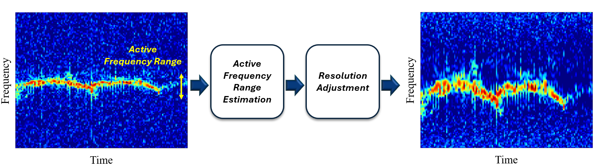

# A simple yet effective method for spectrogram transformation

**Resolution-Adaptive Spectrogram: A simple yet effective method for spectrogram transformation.**

## Overview

The Resolution-Adaptive Spectrogram provides an approach to modify the frequency resolution of a spectrogram nonlinearly, adapting to the active frequency range dynamically. The process involves:

1. **Active Frequency Range Search**: Identifying the range of frequencies where significant activity is observed.
2. **Nonlinear Frequency Resolution Adjustment**: Adapting the frequency resolution based on the identified active range, ensuring optimal representation.

This technique enables deep learning-based recognition models to achieve more accurate classification of micro-Doppler signature types.

For more details, please refer to the related research paper: [Paper Link](#).

## How to Use

By running the **main.m** file, you can compute the resolution-adaptive spectrogram for the example signal.
(Note that MATLAB's Signal Processing Toolbox is required for the active frequency range search algorithm.)
